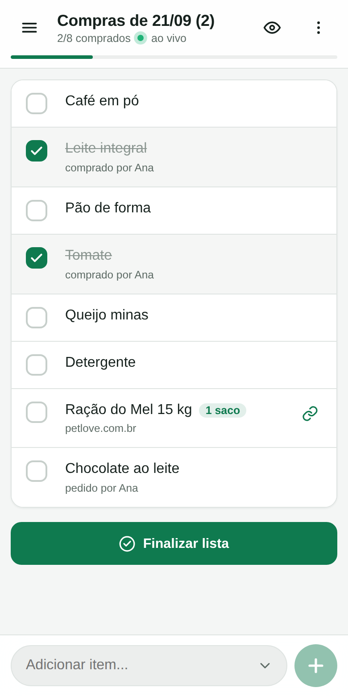
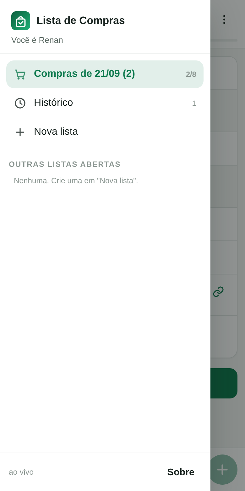
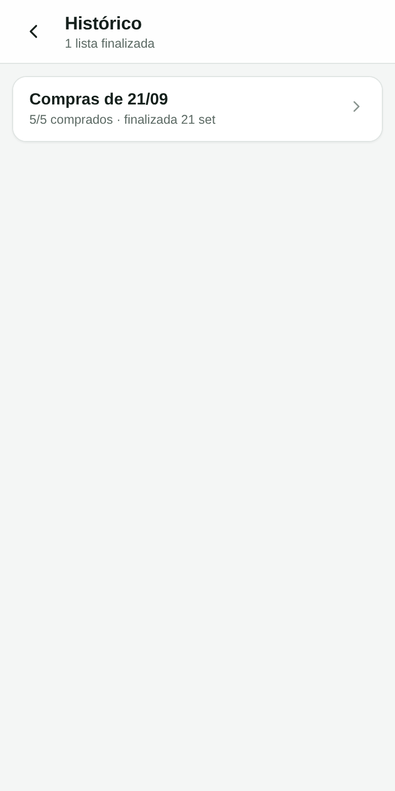

# Lista de Compras da família

Lista de compras compartilhada, feita para rodar numa VPS modesta e abrir como
aplicativo no celular de todo mundo da casa. Quem marca um item no mercado
aparece na hora na tela dos outros.

<p align="center">
  
  
  
</p>

## O que ele faz

- **Uma lista "atual" sempre na tela inicial.** Nunca é preciso escolher lista
  para começar a anotar. Ao finalizar, a próxima já nasce no lugar.
- **Tempo real.** Marcou, digitou, renomeou: chega nos outros aparelhos em
  menos de um segundo, sem recarregar a página.
- **Finalizar lista.** Toda lista tem a ação. A lista finalizada vira histórico
  (com tudo que foi comprado e o que não foi) e os itens pendentes podem ir
  junto para a lista nova.
- **Histórico e listas secundárias no menu.** A tela inicial fica só com a
  lista atual; o resto mora no menu lateral.
- **Link por item.** Para compras online, cada item pode carregar o link do
  produto e vira um atalho para a loja.
- **Instala como app** no iOS e no Android (PWA) — ícone na tela de início,
  tela cheia, sem loja de aplicativos.
- **Funciona com sinal ruim.** Sem internet no corredor do mercado, as
  marcações ficam guardadas no aparelho e sobem sozinhas quando a conexão volta.
- **Sugestões do próprio histórico.** Ao digitar, o app sugere o que a casa já
  comprou antes.
- **Quantidade e observação por item** (2 kg, 3 caixas, "a marca azul").
- **Entrar por link, sem senha.** Quem já tem acesso gera um convite nomeado
  no menu **Acessos** e manda pelo WhatsApp; a pessoa entra só de tocar. A
  sessão não expira sozinha — só sai por logout ou se alguém revogar aquele
  acesso específico.

## Como foi construído

Sem dependências de runtime: só o Node. Isso deixa o consumo baixo (~60 MB de
RAM), o deploy trivial e o projeto fácil de manter daqui a dois anos.

| Camada | Escolha |
| --- | --- |
| Servidor | Node 22 puro (`node:http`) |
| Banco | SQLite via `node:sqlite` (um arquivo, modo WAL) |
| Tempo real | Server-Sent Events (`/api/events`) |
| Front-end | HTML + CSS + JavaScript com módulos nativos, sem build |
| App no celular | PWA (manifest + service worker) |
| Login | Uma senha para a casa + nome de quem está usando |

Detalhes em [docs/ARQUITETURA.md](docs/ARQUITETURA.md) e a lista de rotas em
[docs/API.md](docs/API.md).

## Rodando na sua máquina

Requer **Node 22.13 ou mais novo** — é a versão em que o `node:sqlite`, o banco
embutido que o projeto usa, passou a funcionar sem flag. Se o seu for mais
antigo, o app avisa na hora de subir e diz como atualizar.

```sh
node --version   # precisa ser >= v22.13.0
```

```sh
git clone https://github.com/renansz/shopping_list.git
cd shopping_list
cp .env.example .env          # defina HOUSEHOLD_PASSWORD
npm start                     # http://localhost:3000
```

Não há `npm install`: o projeto não tem dependências.

```sh
npm test      # testes do servidor e das rotas (29 casos, sem dependências)
npm run dev   # reinicia sozinho ao salvar arquivos
```

Há também um teste de ponta a ponta em navegador de verdade — interface, tempo
real entre dois aparelhos e fila offline. Ele é opcional porque precisa do
Playwright, que não é dependência do projeto:

```sh
npm i -g playwright && npx playwright install chromium
npm run test:navegador
```

## Colocando na VPS

Um comando sobe a aplicação **e** o HTTPS (o Caddy cuida do certificado
sozinho):

```sh
git clone https://github.com/renansz/shopping_list.git /opt/lista-de-compras
cd /opt/lista-de-compras
cp .env.example .env && nano .env          # defina HOUSEHOLD_PASSWORD
docker compose --profile proxy up -d --build
```

Antes disso, só é preciso que o domínio aponte para a VPS e que as portas 80 e
443 estejam livres. Se a máquina já tiver um proxy próprio, rode sem o perfil
(`docker compose up -d`) e aponte o seu proxy para `127.0.0.1:3000` — o bloco
pronto está em [`deploy/Caddyfile`](deploy/Caddyfile), e há um equivalente para
Nginx em [`deploy/nginx.conf`](deploy/nginx.conf).

O passo a passo completo — DNS, firewall, verificação, backup e problemas
comuns — está em [docs/DEPLOY.md](docs/DEPLOY.md). Sem Docker, use o serviço
systemd pronto em [`deploy/lista-de-compras.service`](deploy/lista-de-compras.service).

## Instalando no celular

Abra o endereço **https://** no navegador do celular e:

- **iPhone / iPad (Safari):** botão Compartilhar → *Adicionar à Tela de Início*.
  O app abre em tela cheia, sem barra do navegador.
- **Android (Chrome):** aparece o aviso *Instalar aplicativo*; se não aparecer,
  menu ⋮ → *Adicionar à tela inicial*.

Cada pessoa entra uma vez — com a senha da casa, ou por um link de convite
gerado no menu **Acessos** (sem senha nenhuma) — e escolhe o próprio nome. A
sessão fica valendo indefinidamente; ninguém precisa entrar de novo, a menos
que faça logout ou que o acesso seja revogado.

## Backup

O banco é um arquivo só. Para copiar com o serviço no ar:

```sh
npm run backup /var/backups/lista                      # direto na VPS
docker compose exec lista node tools/backup.mjs /data/backups   # com Docker
```

Restaurar é parar o serviço, colocar o `.db` de volta em `data/` e subir de novo.
Veja [docs/DEPLOY.md](docs/DEPLOY.md#backup-e-restauração) para o passo a passo
e a sugestão de cron diário.

## Configuração

Tudo por variáveis de ambiente (arquivo `.env`):

| Variável | Padrão | Para que serve |
| --- | --- | --- |
| `HOUSEHOLD_PASSWORD` | — | Senha única da casa. **Obrigatória.** |
| `PORT` | `3000` | Porta do servidor |
| `HOST` | `0.0.0.0` | Interface de escuta |
| `DATA_DIR` | `./data` | Onde fica o banco SQLite |
| `PORTA_LOCAL` | `3000` | Só com Docker: porta publicada no localhost da VPS |
| `TRUST_PROXY` | `0` | Use `1` atrás de Caddy/Nginx |
| `COOKIE_SECURE` | `auto` | `auto`, `true` ou `false` |
| `AUTH_DISABLED` | `0` | `1` desliga o login (só em desenvolvimento) |

Sessões não têm mais um segredo para configurar: cada login vira um registro
no próprio banco, revogável individualmente pela tela **Acessos** do app (ou
todos de uma vez, com a senha da casa). Veja
[docs/ARQUITETURA.md](docs/ARQUITETURA.md#sessão-e-convites).

## Estrutura

```
server/     API, banco, sessão e eventos em tempo real
public/     o app (HTML/CSS/JS), manifest e service worker
test/       testes com node:test
tools/      geração dos ícones e backup
deploy/     systemd, Caddy, Nginx e script de backup
docs/       arquitetura, deploy e referência da API
```

## Licença

MIT — veja [LICENSE](LICENSE).
